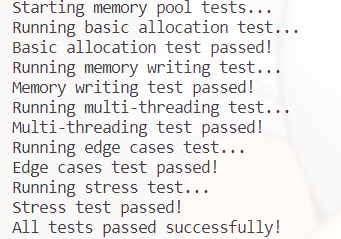
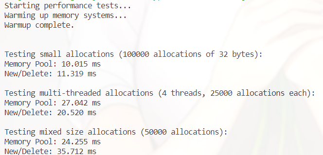

# C++ 高并发内存池 memorypool

本项目是基于 C++ 实现的自定义内存池框架，旨在提高内存分配和释放的效率，特别是在多线程环境下,参考 TCMalloc 分层思想，设计并实现了支持高并发的 C++ 内存池，优化小块内存分配/释放效率。


### 基本实现
release和debug的区别是日志的数量，生产环境下更多的日志会显著降低内存分配的速度。

该项目包括以下主要功能：

- 线程本地缓存（ThreadCache）：每个线程维护自己的内存块链表，减少线程间的锁竞争，提高内存分配效率。

- 中心缓存（CentralCache）：用于管理多个线程共享的内存块，支持批量分配和回收，优化内存利用率。

- 页面缓存（PageCache）：负责从操作系统申请和释放大块内存，支持内存块的合并和分割，减少内存碎片。

- 自旋锁和原子操作：在多线程环境下使用自旋锁和原子操作，确保线程安全的同时减少锁的开销。

  

项目架构图如下：      


  

## 编译  

先进入 release 或 debug项目目录

```

cd release

```

在项目目录下创建build目录，并进入该目录创建日志目录

```

mkdir build

cd build

mkdir log

```

执行 cmake 命令

```

cmake ..

```

执行 make 命令

```

make

```  

删除编译生成的可执行文件：  

```

make clean

```  

## 运行

```

./可执行文件名


```
## 测试结果

### release

#### 功能测试结果



#### 性能测试结果


