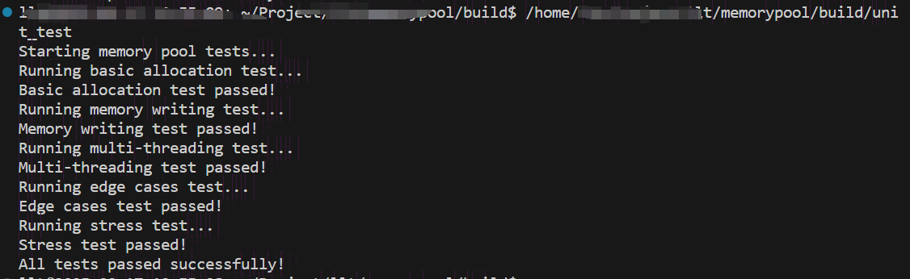
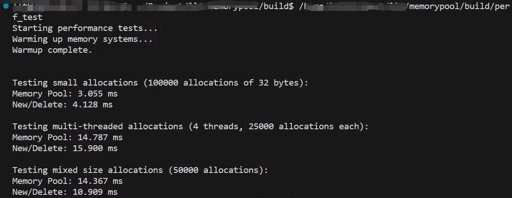

# C++ 高并发内存池 (A High-Performance Concurrent Memory Pool)

## 项目简介

本项目是为解决标准 malloc 在高并发下的**锁竞争**与**系统调用**开销问题，基于 Google tcmalloc 思想，使用 C++17 （lock_guard需要17，手动lock,11即可）独立设计并实现的一个高性能并发内存池。

通过**三层缓存架构** (ThreadCache, CentralCache, PageCache) 和**精细化的锁策略**，本项目旨在为高并发服务器（如 Muduo 网络库中的 Buffer）提供一个高效、可扩展的内存分配解决方案。

## 核心架构与设计思想

本内存池的架构，本质上是在用户态对操作系统内核高效的内存管理思想（如伙伴系统、Slab 分配器）的一次模拟与再创新。

- **ThreadCache (线程缓存)**:
    
    - **职责**: 为每个线程提供一个**完全无锁**的私有内存缓存。
        
    - **实现**: 每个线程通过 thread_local 持有独立的 ThreadCache 实例。内部通过一个自由链表数组 (std::array<void*, FREE_LIST_SIZE>) 管理不同尺寸的空闲内存块。
        
    - **效果**: 绝大多数小内存的分配/释放操作都在此层以 **O(1)** 复杂度完成，彻底消除了多线程间的锁竞争。
        
- **CentralCache (中心缓存)**:
    
    - **职责**: 作为 ThreadCache 的上一级缓存，负责“批量”地供给和回收内存块，平衡不同线程间的内存需求。
        
    - **实现**: 借鉴**内核 Slab 分配器**思想，为每个尺寸等级 (size-class) 维护一个由 Span 组成的双向链表 (SpanList)。通过**细粒度锁**（每个 size-class 一把 std::mutex），最小化了不同尺寸内存分配操作之间的锁冲突。
        
- **PageCache (页缓存)**:
    
    - **职责**: 内存池的最终后备来源，负责与操作系统交互，管理以“页”为单位的大块内存。
        
    - **实现**:
        
        - 通过 mmap 直接向内核申请大块内存，减少了系统调用的频率。
            
        - 内部实现了**伙伴系统 (Buddy System)** 算法，通过**分裂 (Split)** 和**合并 (Merge)** Span 来动态管理不同大小的连续内存页，有效地对抗了内存碎片。
            
        - 使用 std::unordered_map (可优化为**基数树**) 实现了 地址 -> Span 的快速映射，为高效的内存回收提供了 O(1) (均摊) 的查找能力。
            

## 性能测试与分析

为了验证内存池的性能，设计了覆盖单线程、多线程、混合负载等场景的基准测试，并与系统默认的 glibc malloc (ptmalloc) 进行对比。

#### 基础功能与正确性测试

 通过一系列单元测试（包括基本分配/释放、内存写入、多线程安全、边界条件、压力测试），确保了内存池在各种场景下的功能正确性和稳定性。

#### 并发性能测试 (4核 CPU)
为了验证内存池的性能，设计了覆盖单线程小对象、中等并发和混合负载等场景的基准测试，并与系统默认的 glibc malloc (new/delete) 进行对比。

|                          |              |                        |              |
| ------------------------ | ------------ | ---------------------- | ------------ |
| 测试场景                     | **内存池 (ms)** | **系统 New/Delete (ms)** | 性能对比         |
| **单线程-小对象** (10万次 x 32B) | **3.055**    | 4.128                  | **1.35x 胜出** |
| **多线程** (4线程 x 2.5万次)    | **14.787**   | 15.900                 | **1.07x 胜出** |
| **单线程-混合大小** (5万次)       | 14.367       | **10.909**             | 0.76x        |

#### 性能分析

1. **小对象与并发优势明显**: 在高频次的**单线程小对象**分配场景中，内存池凭借 ThreadCache 极简的 O(1) 链表操作，性能超出系统 malloc 约 **35%**。在 **4 线程**（核心数）并发测试中，ThreadCache 的无锁设计有效避免了线程间冲突，性能依然保持领先。
    
2. **混合负载下的思考**: 在单线程混合大小的测试中，glibc malloc 表现更优。这主要归因于 glibc 经过数十年发展的**极致优化**，其内部的 tcache 和 fastbins 对这种多变但无竞争的负载模式有非常高的缓存命中率。相比之下，我的内存池在每次 allocate 时需要进行 SizeClass 计算和Span分配计算合并和分裂的开销，这在无锁的单线程场景下造成了微小的性能差距。
## **下一步优化方向**：

1. **PageCache 分片 (Sharding)**：将 PageCache 的全局锁拆分为多把分片锁，从根本上解决高并发下的扩展性瓶颈。
    
2. **基数树优化**：将 std::unordered_map 替换为更高效的基数树，实现 O(1) 的地址->Span 查找。
    
3. **系统集成**：将内存池作为静态库，集成到 MiniMuduo 项目的 Buffer 类中，完成最终的性能闭环。